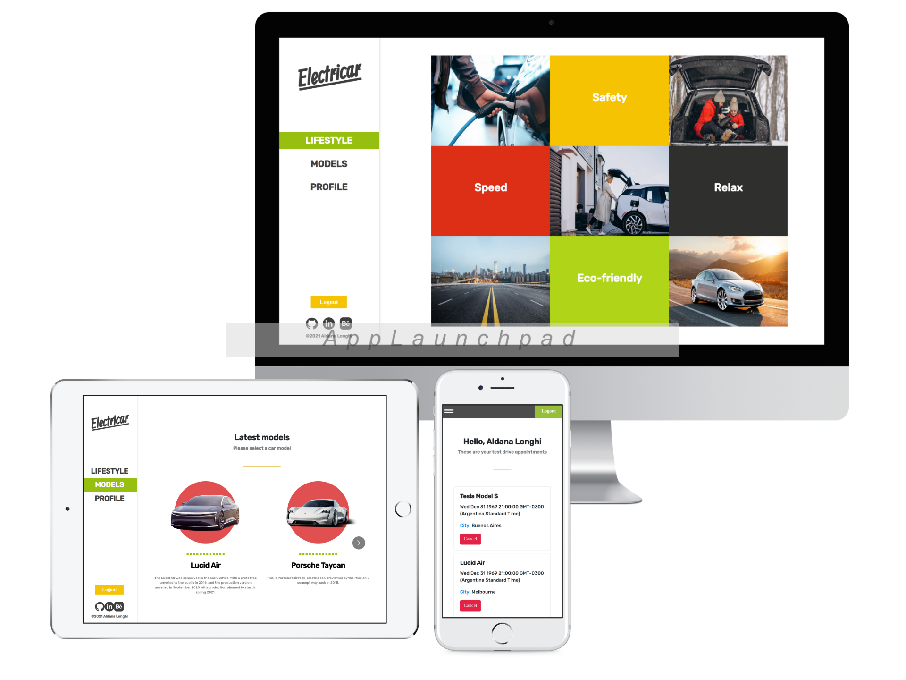

# Try an electric car

## What is this project about? 

This project consisted on building the front-end application for a full-stack website where you can book appointments for electric cars' test drive.

Users can:
- Sign up, log in and sign out.
- Check the catalogue of available car models.
- Go to model's details page and book a test drive appointment.
- Go to their profile and check all of their appointments.

## Built with: 

- React

**Features**
- [React](https://reactjs.org/)
- [Stylelint](https://github.com/stylelint/stylelint)
- [Eslint](https://eslint.org/)
- [Create React App](https://github.com/facebook/create-react-app).

## Live demo link

[Electricar](https://electricar.herokuapp.com/)

## How to use this app locally?

**Pre-requisites**

- Having [Node](https://nodejs.org/en/) installed on your machine.

### Setting up instructions 

**In case you use Git**

1. Open terminal 

2. Run the following commands:

- `git clone https://github.com/AlduLonghi/try-an-electric-car-frontend.git`

- `cd try-an-electric-car`

- `npm install`

- `npm start`

3. To run the tests:

- `npm test`

**In case you don't use a control version system**

1. Go to [the repository](https://github.com/AlduLonghi/try-an-electric-car-frontend.git)

2. Press the green button that says "Code".

3. Press "Download zip".

4. Once downloaded, extract the files.

5. Right click on the folder, press "Open in terminal".

6. Run:

- `npm install`

- `npm start`

## Author 

👤 **Aldana**
​

- Github: [@AlduLonghi](https://github.com/AlduLonghi)

- Twitter: [@AbrilLonghi](https://twitter.com/AbrilLonghi)

- Linkedin: [Aldana Abril Longhi](https://www.linkedin.com/in/aldana-abril-longhi-a842ba1a7/)

## Contributing 

- To contribute to this project:
- Fork this repository & clone locally.
- Create an upstream remote and sync your local copy.
- Create a new branch.
- Push your code to your origin repository.
- Create a new Pull Request .

## Show your support

Give a ⭐️ if you like this project!
​

## Acknowledgments

- Microverse curriculum.
- [Murat Korkmaz on Behance](https://www.behance.net/muratk)
